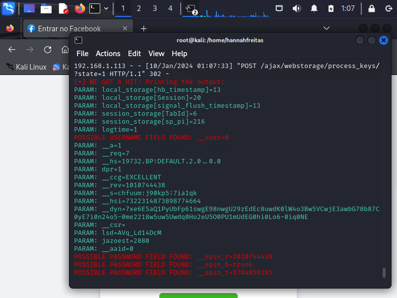

# Phishing para captura de senhas do Facebook

### Ferramentas

- Kali Linux
- setoolkit

### Configurando o Phishing no Kali Linux

- Acesso root: ``` sudo su ```
- Iniciando o setoolkit: ``` setoolkit ```
- Tipo de ataque: ```1 - Social-Engineering Attacks ```
- Vetor de ataque: ```2 - Web Site Attack Vectors ```
- Método de ataque: ```3 - Credential Harvester Attack Method ```
- Método de ataque: ```2 - Site Cloner ```
- Obtendo o endereço da máquina: ``` ifconfig ```
- URL para clone: http://www.facebook.com
- Copiar o IP e testar um usuário e senha em um navegador

### Resutados



<h3> * Não sei qual o motivo de não ter capturado certo a senha e o login de teste que eu testei!