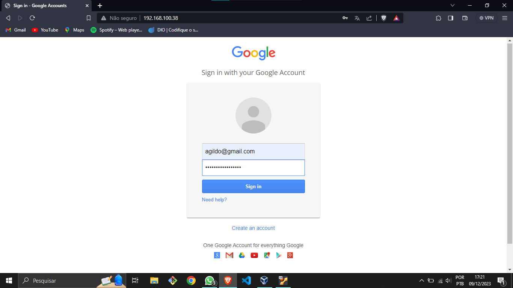

# Phishing para captura de senhas do Google

### Ferramentas

- Kali Linux
- setoolkit

### Configurando o Phishing no Kali Linux

- Acesso root: ``` sudo su ```
- Iniciando o setoolkit: ``` setoolkit ```
- Tipo de ataque: ``` Social-Engineering Attacks ```
- Vetor de ataque: ``` Web Site Attack Vectors ```
- Método de ataque: ```Credential Harvester Attack Method ```
- Método de ataque: ``` Web Templates ```
- Obtendo o endereço da máquina: ``` ifconfig ```
- URL para redirecionamento: www.google.com 

### Resutados



_durante a atividade tentei de várias formas clonar a página de login do facebook, no entanto mesmo fazendo os passos ensinados nos vídeos do curso as credenciais de login não aparecem no terminal_
