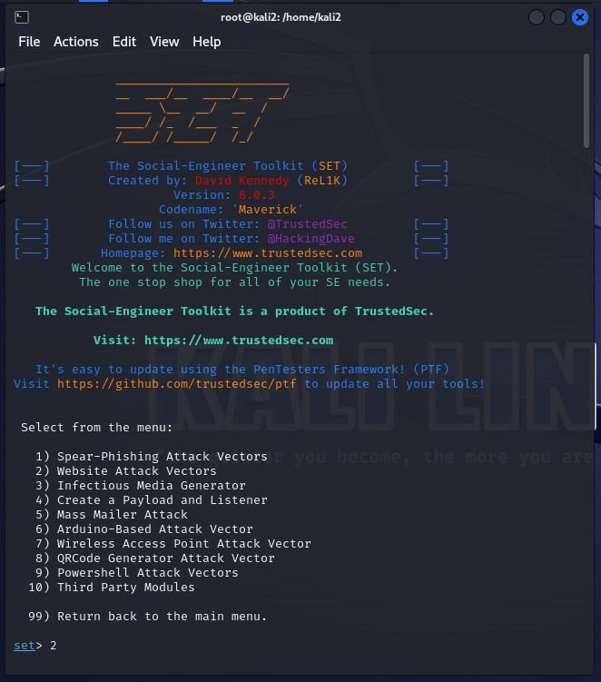
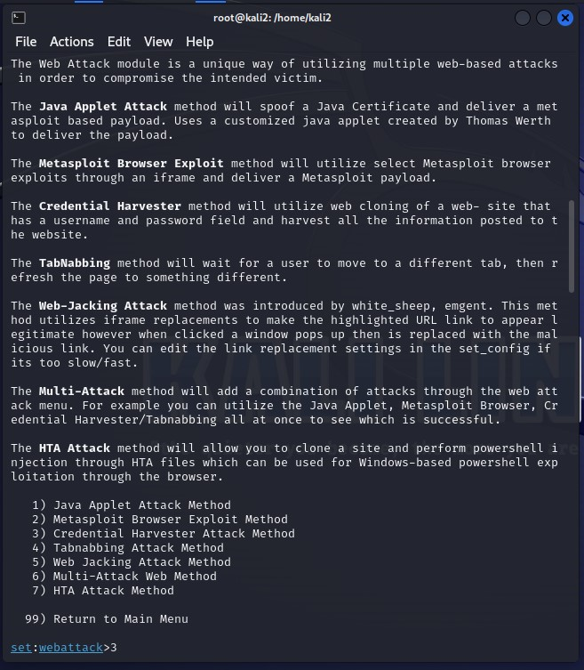
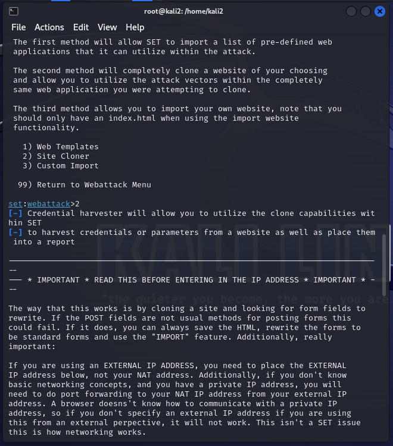
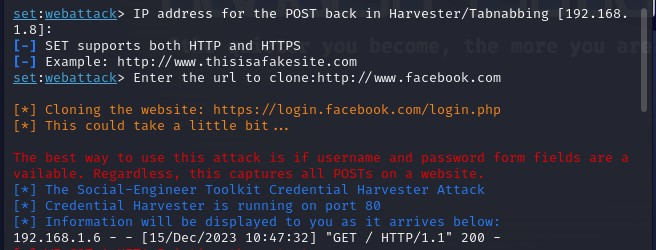
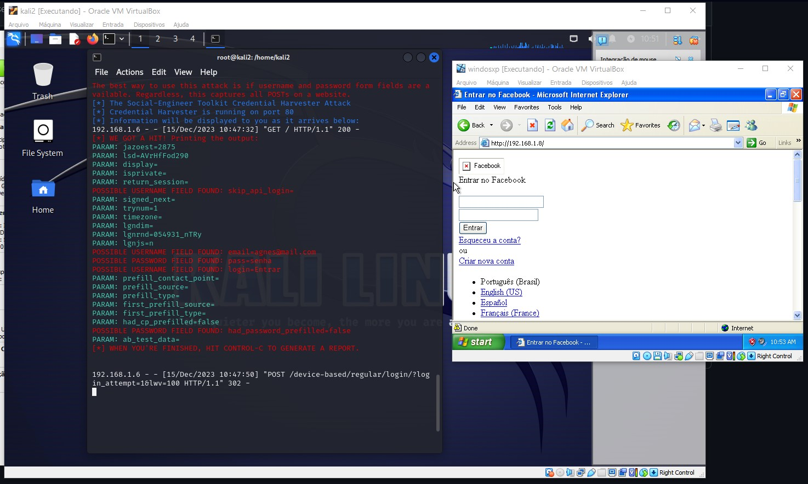
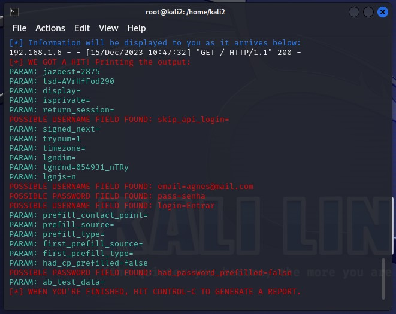

# Phishing para captura de senhas do Facebook

### Ferramentas

- Kali Linux
- setoolkit

### Configurando o Phishing no Kali Linux

- Acesso root: ``` sudo su ```
- Iniciando o setoolkit: ``` setoolkit ```
- Tipo de ataque: ``` Social-Engineering Attacks ```



- Vetor de ataque: ``` Web Site Attack Vectors ```



- Método de ataque: ```Credential Harvester Attack Method ```



- Método de ataque: ``` Site Cloner ```



- Obtendo o endereço da máquina: ``` ifconfig ```
- URL para clone: http://www.facebook.com

Eu tive varios problemas para conseguir o resultado esperado, primeiro o virtualBox não estava sendo instalado corretamente no meu computador com SO Linux-Unbuntu, então passei para outro computador com SO Windows 11, nesse SO consegui instalar o virtualbox e o kali linux.

Porém mesmo com todos os passos a passos da video aulas o setoolkit não capitava as informações do usuário e senha, eles vinham criptografados, olhando naa internet algumas respostas para esse mesmo erro falava que algumas vezes havia criptografia antes da informação entrar no banco e por isso o setoolkit não conseguia captar corretamente.

Depois de tentar em vários outros sites, decidi tentar por outra maquina virtual, a unica que funcionou foi a do windowsXP.

Talvez valha a pena para o curso adaptar esse erro, e tentar mostar os motivos do qual ele poderia ter sido gerado.



### Resutados



Obs. O email e senha são falsos
resultado