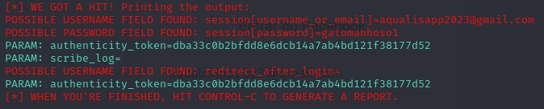

# Phishing para captura de senhas do Facebook

### Ferramentas

- Termux
- zphisher 

### Configurando o Phishing no Termux

- Clonando o repositorio: ``` git clone --depth=1 https://github.com/htr-tech/zphisher.git ```
- Entrando na pasta zphisher: ``` cd zphisher ```
- Inicializando o zphisher: ``` bash zphisher  ```
- Opcao de ataque: ``` [1]Facebook ```
- Método de ataque: ``` [1]Traditional Login Page ```
- Selecionar o serviço de porta: ``` [1]Local Host ```
- Caso queria um serviço de porta personalizada: ``` Eu escolhi "N" ```
- Depois é só copiar e colar o host http:// e fazer os testes :D

### Resutados


